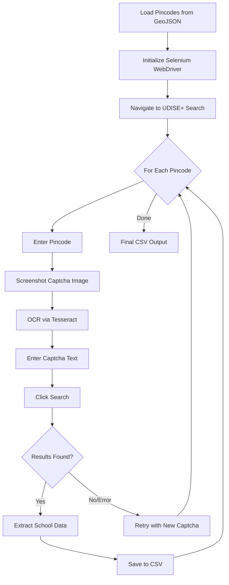

# UDISE+ School Scraper — Pincode Level Data Extraction

## Background

Extract school-level data from the [UDISE+ Know Your School portal](https://kys.udiseplus.gov.in/#/advancesearch) for all India pincodes. The portal requires a captcha to be solved for each search query, so the scraper needs to handle this automatically.

## Proposed Approach

Build a **Python + Selenium** scraper that uses **OCR (Tesseract)** to automatically read and solve the captcha for each pincode search. The scraper will:

1. Open the UDISE+ advance search page
2. Select "PIN Code" radio button
3. For each pincode: enter the pincode, solve the captcha via OCR, click search, and extract the school list
4. Save results to CSV files with checkpoint/resume capability

### Architecture

## User Review Required

> [!IMPORTANT]
> **Legal & Ethical Considerations**: The UDISE+ portal is a government website. Automated scraping may violate their Terms of Service and could potentially have legal implications under the Information Technology Act, 2000. This script is built for **educational/research purposes only**. Please ensure you have the necessary authorization before running this at scale.

> [!WARNING]
> **Rate Limiting**: The script includes delays between requests (3-5 seconds) to avoid overwhelming the server. Running too fast may result in IP blocking. For ~20,000 pincodes, this could take **15-30+ hours** to complete.

## Open Questions

> [!IMPORTANT]
> 1. **Pincode Source**: Your workspace has a `Datagov_Pincode_Boundaries.geojson` file (90MB). Should I extract pincodes from this file, or do you have a separate CSV/list of target pincodes? Processing all ~20,000 Indian pincodes will take very long.
> 2. **Scope**: Do you want ALL pincodes or a subset (e.g., specific states/districts)?
> 3. **What data fields do you need?** The school search results likely include: School Name, UDISE Code, Address, Category, Management, Type, etc. Should I capture all available fields?

## Proposed Changes

### Setup & Dependencies

#### [NEW] [requirements.txt](file:///c:/Users/soham/Desktop/icici/project/school-scrape/requirements.txt)
- `selenium` — Browser automation
- `Pillow` — Image processing for captcha
- `pytesseract` — OCR for captcha solving
- `pandas` — Data processing & CSV output
- `webdriver-manager` — Auto-manage ChromeDriver

---

### Core Scraper

#### [NEW] [scraper.py](file:///c:/Users/soham/Desktop/icici/project/school-scrape/scraper.py)
Main scraper script with:
- **`UDISEScraper` class** with methods for:
  - `setup_driver()` — Initialize headless Chrome with stealth settings
  - `get_captcha_text()` — Screenshot captcha element, preprocess image, run OCR
  - `search_pincode(pincode)` — Full search flow: enter pincode → solve captcha → click search → extract results
  - `extract_school_data()` — Parse the results table into structured data
  - `run(pincodes)` — Main loop with checkpoint/resume support
- **Captcha solving strategy**: 
  - Screenshot the captcha image element
  - Preprocess (grayscale, threshold, denoise)
  - Run Tesseract OCR
  - If captcha fails, retry up to 5 times with fresh captcha
- **Checkpoint system**: Save progress after every pincode so the script can resume if interrupted
- **Error handling**: Retry logic, timeout handling, connection error recovery

---

### Pincode Extraction

#### [NEW] [extract_pincodes.py](file:///c:/Users/soham/Desktop/icici/project/school-scrape/extract_pincodes.py)
Utility script to extract unique pincodes from `Datagov_Pincode_Boundaries.geojson`

---

### Configuration

#### [NEW] [config.py](file:///c:/Users/soham/Desktop/icici/project/school-scrape/config.py)
Central configuration file for:
- Delay settings (between requests)
- Retry limits
- Output file paths
- Tesseract executable path
- Chrome options

## Verification Plan

### Manual Verification
1. Run the scraper on 3-5 sample pincodes (e.g., 110001, 400001, 560001)
2. Verify extracted school data matches what the website shows
3. Confirm captcha solving success rate
4. Check CSV output format and completeness
